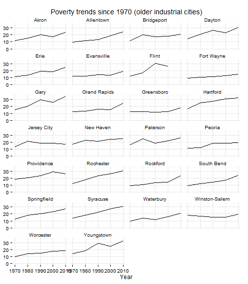

## Poverty indicators

Three related poverty indicators will be covered here:
* % of persons below poverty line
* % of persons below 200% of poverty line
* % of children below poverty line
All three were among the most highly-ranked indicators in the survey. 

## Data and limitations

The measurement of poverty is complex and there are several approaches and much research [on this subject](http://www.census.gov/hhes/www/poverty/about/overview/measure.html). (For a user-friendly introduction, NPR's Planet Money had [some recent](http://www.npr.org/blogs/money/2013/08/27/214822459/a-college-kid-a-single-mom-and-the-problem-with-the-poverty-line) [programs](http://www.npr.org/blogs/money/2013/09/16/223086399/the-poverty-rate-ignores-programs-that-fight-poverty) on this.) 

In most cases, indicator systems rely on data from the U.S. Census Bureau, generally from either the decennial census, the annual American Community Survey updates or the Current Population Survey. 

Use of census data creates some difficulties. Reliance on the decennial census means using poverty data that is produced only once each decade. More frequent updates rely on sample surveys though, which means there can be large margins of error for small geographies. In practice, for the Hartford region this generally means towns in the region need [at least three and often five-years of data to create reliable estimates](http://www.census.gov/acs/www/methodology/sample_size_and_data_quality/Community Survey). In other words, [2011 poverty data for Vernon](http://ctdata.org/communityprofile-Vernon) reflects five-years of rolling surveys (2006 - 2010 or 2007 - 2011) of individuals in that town. 

Other demographic issues, like a [large off-campus student population](http://blogs.census.gov/2013/07/29/when-off-campus-college-students-are-excluded-poverty-rates-fall-in-many-college-towns/), can effect the results for some towns. Data on Mansfield is particularly affected by this in Connecticut, although the impact is not large for other towns. 

Serveral alternative measures of poverty are available - the [supplemental poverty measure](http://www.census.gov/hhes/povmeas/methodology/supplemental/research.html), [multi-dimensional poverty index](http://www.ophi.org.uk/policy/multidimensional-poverty-index/) - but generally not with the level of detail or frequency typically used in indicators projects. New York City's Center for Economic Opportunity creates [their own poverty measure](http://www.nyc.gov/html/ceo/downloads/pdf/ceo_poverty_measure_2005_2011.pdf) for the city to reflect cost of living and benefits payments. The inclusion of these factors starts to move the poverty rate closer to self-sufficiency calculations, such as in the [Connecticut BEST tables](http://ctpcsw.com/basic-economic-security-tables/) or in the [ALICE report](http://www.unitedwaynnj.org/documents/UWNNJ_ALICE%20Report_FINAL2012.pdf) from the United Way of Northern New Jersey. 

## What do we already know?

Below are references for some local, regional and national reports that use poverty rate indicators above, with some details on how the data is used. Poverty is referenced in many indicators reports and systems and the list below is far from comprehensive.

### Local

* [CETC Report Card](http://www.ctdol.state.ct.us/OWC/CETC/2013ReportCard.pdf) includes the population living under 200% of poverty level as an indicator for the state. 
* [CT Fair Housing Center Opportunity Mapping](http://www.ctfairhousing.org/people-place-and-opportunity-report/) (developed with the Kirwan Institute at Ohio State) includes the neighborhood poverty rate as one factor. 
* [CT Kids Report Card](http://www.cga.ct.gov/kid/rba/results.asp) has 'children living in poverty' as an indicator of 'Future Success.'
* [CWP Community Workforce Development Report Card](http://www.capitalworkforce.org/ctworks/documents/Community_Workforce_Development_Report_Card_2011ff.pdf) includes the percent living under 200% of the poverty line as an indicator of self-sufficiency for adults. 
* [Hartford Neighborhood Assessments](http://courantblogs.com/cityline/wp-content/uploads/2013/04/Hartford-Neighborhood-Assessment.pdf) report published by Hartford Public Schools uses the child poverty rate (by neighborhood) as one factor in their index. 
* [Health Equity Index](http://www.cadh.org/health-equity/health-equity-index.html) includes both the poverty rate and children living in poverty as factors in the index. 
* [Pioneer Valley State of the People](http://pvpc.org/resources/datastats/state-of-people/stateofthepeople2013.pdf) include the poverty rate in their 'Poverty' domain. 
* [Sustainable Knowledge Corridor Dashboard](http://www.sustainableknowledgecorridor.org/site/content/how-are-we-doing) includes both poverty as an indicator of access to opportunity and high concentrations of poverty and racial segregation as an indicator within the housing domain. 
* [Population Results Working Group](http://www.ct.gov/opm/cwp/view.asp?a=2998&Q=490946) cites 'Percent of population with income less than the 200% of Federal Poverty Level (Broken out by age group (youth, adults and seniors)' as an indicator to track. 
* [Opportunities Hartford](http://www.cahs.org/programs-opportunitieshartford.asp) does not directly include poverty rates, but does include measures such as '% of income for families < 200% poverty given to child care / food costs' and '# / % families at 100% FPL without 3 months emergency funds' within a set of indicators and performance measures. 
* [Data Haven's Community Well-Being Index](http://www.ctdatahaven.org/communityindex) includes both the poverty rate and '% of children age 0-5 who are living in families with a moderate or higher income' as components of their index. 
* [CT Voices for Children](http://www.ctvoices.org/) plans to include both child poverty rates and families living under 200% of the poverty line as indicators within the coming months. 

### Other relevant efforts

* [Boston Indicators Project](http://www.bostonindicators.org/) looks at several indicators of poverty, including poverty rates by race / ethnicity, educational attainment and neighborhood, and poverty by households and for children in families. 
* [Resurgent Cities](http://www.bostonfed.org/about/ar/ar2009/lessons-from-resurgent-cities.pdf) is a report from the Federal Reserve Bank of Boston, which looks at population, poverty and other factors for older, industrial cities, including Hartford. 
* [The Child Well-Being Index](http://fcd-us.org/our-work/child-well-being-index-cwi) includes poverty rate as one indicator of family economic well-being. 
* [The Rhode Island Community Foundation](http://www.rifoundation.org/CommunityLeadership/CommunityDashboard/tabid/1157/Default.aspx) looks at both the poverty rate and the percent of families living under 185% of the federal poverty line within their basic demographics ('Know Rhode Island').
* [What Matters to Metros](http://www.futurefundneo.org/whatmatters) includes the poverty rate and the percent of the population between 125 - 200% of the poverty line as factors in their model.
* [Chicago Deparment of Public Health](https://data.cityofchicago.org/Health-Human-Services/hardship-index/792q-4jtu) includes poverty as one of the factors in their 'Hardship index' (originally developed via the Rockefeller Institute).
* [The Declaration Initiative](http://15th-www.declarationinitiative.org/poverty-in-america/6-deadly-poverty-trap-triggers) identifies six 'Poverty Trap Triggers' that 'undermine basic quality of life.'

## Sample results

For the Hartford region, the following is some sample data for the main indicators. (Some of the following only show the 29 towns in the Foundation's catchment, but could be expanded easily.)

We can look at poverty rates for individual towns in the region. (The Census Bureau calculations changed in 1970 so earlier data is excluded.)

 


The additional poverty measures are closely correlated with the poverty rate (the percent living under 100% of the federal poverty line), although the levels for each tell a different story. 

 


We can also convert poverty rates to look at the number of people living in poverty. 

 


Number of people in poverty by type of town

 


How does the City of Hartford compare to other similar cities? The resurgent cities report provides a benchmark set of cities for this indicator: 

 


If we combine poverty with other factors, such as long-term population changes, we can identify cities in similar circumstances: 

 


Poverty data is released with several demographic breakouts (age, race / ethnicity, nativitiy, etc.) although the smaller the subgroup the higher the margin of error for the estimates. 

Poverty data is also released by census tract, meaning that we can look at poverty rates within towns. The maps below display poverty rates for census tracts in Hartford and Tolland counties, for the most recent ACS data (2011 5-year estimates). 


```
## Testing geography item 1: Tract *, Hartford County, Connecticut .... OK.
## Testing geography item 2: Tract *, Tolland County, Connecticut .... OK.
```

 


Here is another view of the same data, with a different way of coloring the same map. 

 


Similar maps could be produced for the other poverty measures currently available or with demographic breakouts. Brookings and others have looked at 'concentrated poverty' measures and identified areas of concentrated or racially concentrated poverty (generally based on combined thresholds for poverty and racial segregation). 

